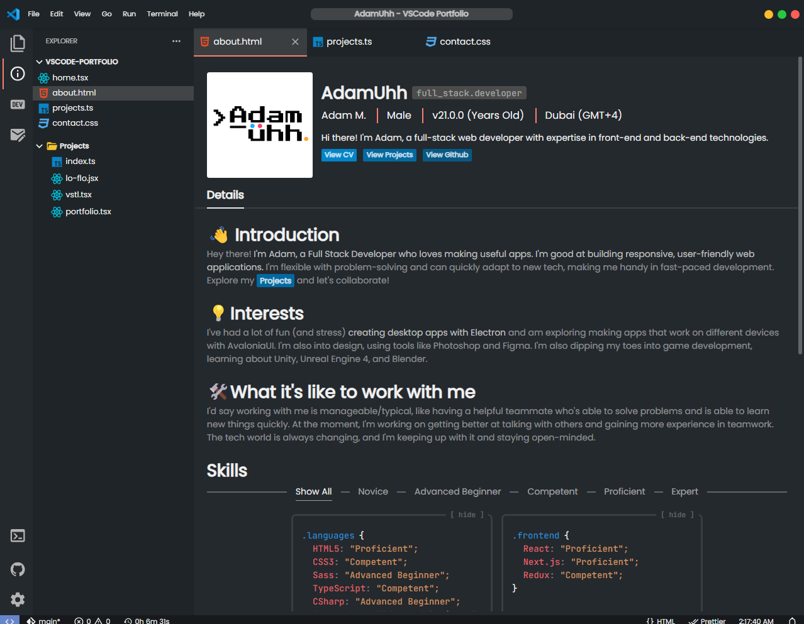

<div align="center">

[](https://adamuhh.dev)

<h1>AdamUhh's <br/> <span style="font-size:20px">VSCode Portfolio Website</span>
</h1>
<h3>
  <a href="https://adamuhh.dev" target="_blank">adamuhh.dev</a>
</h3>

</div>

---

<h3>Hiya!👋</h3>

**This VSCode like portfolio features my technical skills and some of my github projects.**

[](https://adamuhh.dev)

## 🛠️ Built With

- **NextJS v14**
- **TailwindCSS**
- **AWS SNS (SDK JavaScript v3)**

---

## 🧑🏻‍💻 How to run 🧑‍💻

```cli
npm run dev
```

### Get contact form to work

- Create an AWS SES account
- Go to `src\components\ContactMe\Form\action.ts`
- Scroll down until you find these two lines, and change their emails
  
```cli
// ? change to your email
Destination: {
    ToAddresses: ["adamuhh.dev@gmail.com"], 
}
...
...

// ? change to any email from your domain,
// ? this just says who the email was from
Source: "Portfolio Contact Form <contact@adamuhh.dev>", 
```

- Create a .env file in your root folder and put

```cli
AWS_REGION='YOUR REGION'
AWS_ACCESS_KEY_ID='YOUR ACCESS KEY'
AWS_SECRET_ACCESS_KEY='YOUR SECRET KEY'
```

### How to publish

- Required: Make sure you have the vercel CLI

```cli
vercel --prod
```